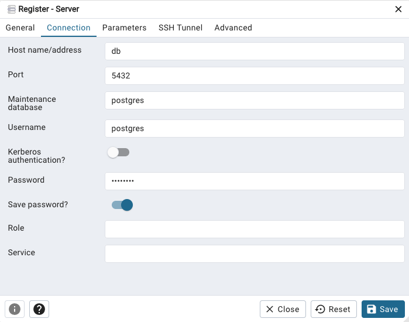
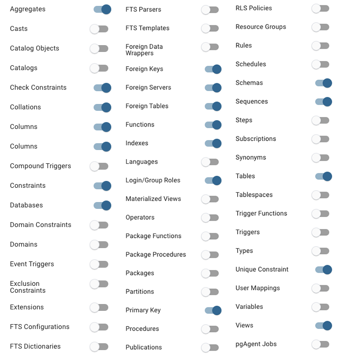
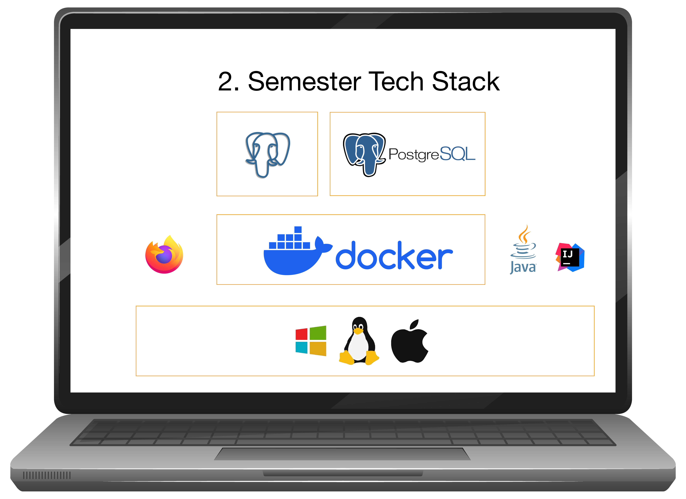

# Setting up Postgres and PgAdmin

This documents tells you  how to setup Postgres and PgAdmin for 2nd semester on you local machine. The two applications, Postgres and PgAdmin both run in isolated Docker Containers. Postgres as a Database Server and PgAdmin as a Database Client. You will launch PgAdmin through a browser.

This [video tutorial](https://cphbusiness.cloud.panopto.eu/Panopto/Pages/Viewer.aspx?id=b2d67d7f-1dfe-4fe5-894c-b1170155d75f) introduces the setup procedure, as described in this document.


## Setup Localhost

### 1. Install Docker Desktop

[Docker Desktop](https://docs.docker.com/get-docker/). If you are installing on Windows, you might need to update WSL. A message with instructions will show if necessary during installation. If so, open the PowerShell as Administrator and type:

```bash
wsl --install
```

Now you have a Linux distribution on your Windows OS.

### 2. Clone this repo

Clone this repo and open the folder with docker-compose.yml in `Git Bash` on Windows or `Terminal` on Mac.

### 2. Run Docker

```bash
  docker compose up -d
```

### 3. Access Postgres pgadmin dashboard through browser

```bash
  localhost:8080
```

#### 3.1. Login

- login: **<admin@cphbusiness.dk>** (see docker-compose.yml)
- password: **1234** (see docker-compose.yml)

#### 3.2. Add new server

- Choose: Server -> Register -> Server

On Register - Server dialogue:

- On General tab:
  - Name: localhost

- On Connection tab:
  - Host name/address: **db**
  - Port: **5432**
  - username: postgres
  - password: postgres



#### 3.3 Fine tune PgAdmin

To simplify the UI, you can hide unused menus here:

- File -> Preferences -> Nodes

You can easily hide these guys:



***

## Docker commands

### Stop Docker

```bash
  docker compose down
```

### Reset DB data installation

(-v) // remove volumes

```bash
 docker compose down -v 
```

```bash
 sudo  rm -rf ./data
```

***

### Debugging

- Check if all containers are running with `docker ps -a`
- Check if all env variables are set in .env file and are correct
- Check if docker compose has read all environment variables with `docker-compose config`
- Check the logs of the individual container with `docker logs <container_name>` or `docker logs --follow <container_name>`

## Documentation

- [PostgreSQL](https://www.postgresql.org/) for database
- [pgAdmin](https://www.pgadmin.org/) for database management
- [Docker](https://www.docker.com/) for containerization
- [Docker Compose](https://docs.docker.com/compose/) for container orchestration.


